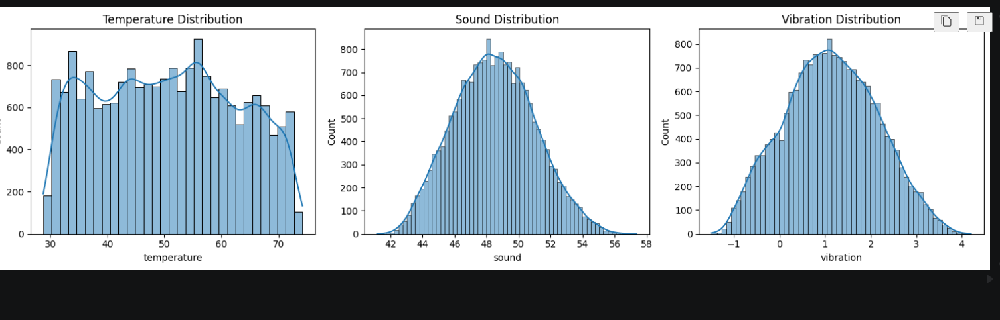
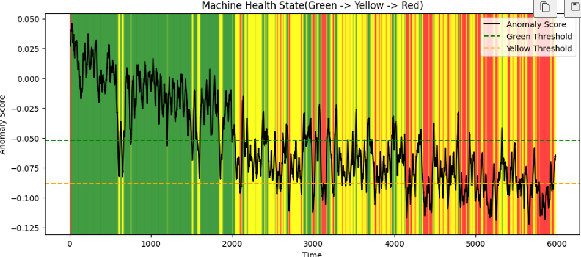
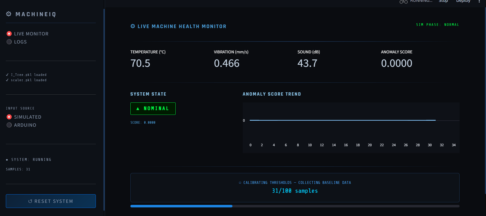
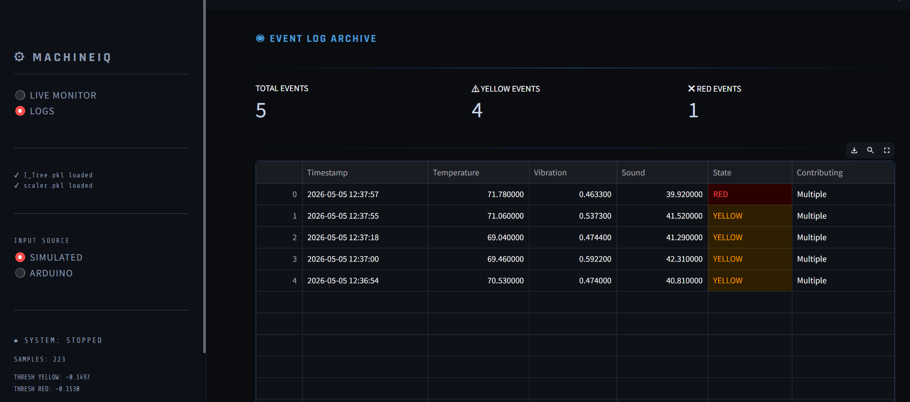

# Multi--Sensor-IoT-ML-Industrial-Monitoring-System
A real-time industrial machine monitoring system that combines <b>multi-sensor IoT sensing</b> with <b>machine learning-based anomaly detection</b>. 
The system monitors <b>temperature, vibration, and sound</b>, extracts <b>rolling statistical features</b>, evaluates machine health using an <b>Isolation Forest model</b>, and displays live machine state through a <b>Streamlit dashboard<b>.
Unlike simple threshold systems, this project focuses on detecting <b>early degradation before critical failure<b>.

----

### Project Motivation
Industrial machines rarely fail suddenly.
Before breakdown, small physical changes begin to appear in parameters like:
- temperature
- vibration
- acoustic behaviour
Those samll deviations are usually ignored until they become expensive.
This project is built to answer a simple question:
#### Can we detect machine degradation early enough to act before failure?

----

### What This System Does

#### Real-time monitoring of:
- Temperature (°C)
- Vibration (mm/s)
- Sound (dB)
#### Machine Learning detects:
- Normal operation
- Early degradation
- Critical failure
#### Dashboard provides:
- live sensor values
- anomaly score trend
- state alerts
- anomaly logs
- CSV export

----

### System Architecture
```
Temperature / Vibration / Sound Sensors
                ↓
            Arduino
                ↓
         USB Serial Input
                ↓
     Feature Engineering Layer
   (Rolling Mean + Rolling Std)
                ↓
      Isolation Forest Model
                ↓
      State Classification Logic
     (GREEN → YELLOW → RED)
                ↓
        Streamlit Dashboard
```

----

### Machine Learning Pipeline

#### Base Features
Raw sensor inputs:
- temperature
- vibration
- sound
#### Derived Features
Using a rolling window:
- rolling mean of each sensor
- rolling standard deviation of each sensor
#### Final Input Vector
``` Python
[
    temp, vib, sound,
    mean_temp, mean_vib, mean_sound,
    std_temp, std_vib, std_sound
]
```
#### Rolling Window
```Python
WINDOW = 50
```
----

### Model Used

#### Isolation Forest
The project uses an <b>Isoaltion Forest</b> anomaly detection model.
<b> Why Isolation Forest? </b>
Because it:
- works well without labeled failure data
- handles anomaly detection naturally
- is lightweight enough for real-time scoring

----

### Calibration Logic
Before predictions begin, the dashboard collects baseline normal behaviour.
```Python
INIT_SAMPLES = 100
```
During calibration:
- feature vectors are collected
- anomaly score distribution is learned
- thresholds are frozen

<b> Thresholds</b>
- Yellow alert -> 15th percentile
- Red alert -> 5th percentile

----

### Machine Health States

#### 🟢 GREEN - Nominal
Machine is behaving normally. Monitoring continues.
#### 🟡 YELLOW - Early Detection
The model detects deviation from normal behaviour. The dashboard:
- raises warning
- logs event
- keeps monitoring
#### 🔴 RED - Critical Failure
A strong anomaly is detected. The system:
- raises critical alert.
- logs event
- halts monitoring
This mimics practical indutrial behaviour.

----

### Input Modes

#### 1. Simulated Mode
The dashboard includes a built-in three-phase synthetic simulation:
- Normal: Stable behaviour
- Degradation: Gradual drift and increasing instability
- Failure: Spikes and unstable sensor patterns.
This is useful for demos and development.

#### 2. Arduino Mode
Real-time sensor input from <b>Arduino</b> via USB serial.
Expected Arduino output format:
```C++
Serial.println("72.3, 0.52, 48.1");
```
----

### Dashboard Pages

#### <b>Live Monitor</b>
Shows:
- live sensor values
- anomaly score
- anomaly score trend
- current machine state
- calibration progress
- live alerts

#### <b>Logs</b>
Stores:
- timestamp
- temperature
- vibration
- sound
- alert state
- contributing sensors
Also supports CSV export.

----

### Screenshots

#### Sensor Distributions

```Markdown

```

#### Model State Plot

```Markdown

```

#### Streamlit Dashboard

```Markdown

```

```Markdown

```
----

### Repository Structure

```
Multi--Sensor-IoT-ML-Industrial-Monitoring-System/
│
├── Model_Training/
|   ├── modelTraining_rawFeatures.ipynb
|   ├── modelTraining_updatedDataset.ipynb
├── app/
|   ├── app_v1.py
├── data/
|   ├── EDA.ipynb
|   ├── Synthetic_industrial_sensor_data_V4.csv
|   ├── syntheticDataset_GenerationCode.py
|   ├── updated_data.csv
├── images/
│   ├── temp_distribution.png
│   ├── vibration_distribution.png
│   ├── sound_distribution.png
│   ├── state_plot.png
│   ├── dashboard_live.png
│   └── dashboard_logs.png
├── model/
│   ├── I_Tree.pkl
│   └── scaler.pkl
├── LICENSE
├── README.md
└── requirements.txt
```
----

### Installation

#### Clone the repo:
```Bash
git clone https://github.com/Shagun-Thakur/Multi--Sensor-IoT-ML-Industrial-Monitoring-System.git
cd Multi--Sensor-IoT-ML-Industrial-Monitoring-System
```
#### Install dependencies:
```Bash
pip install -r requirements.txt
```
#### Run the Dashboard
```Bash
python -m streamlit run app/app_v1.py
```
----

### Arduino Usage
To use hardware input:
1. Connect Arduino by USB
2. Open dashboard
3. Select Arduino Mode
4. Select serial port
5. Click Connect
Expected serial format:
```
temperature, vibration, sound
```

----

### Authors
- ShagunThakur
- Sakshi Rana
